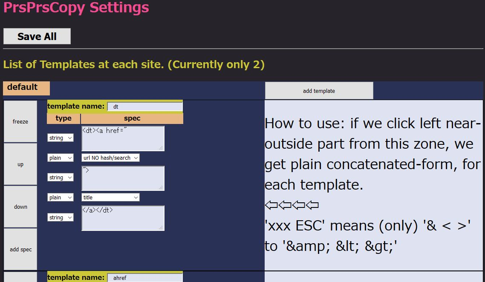
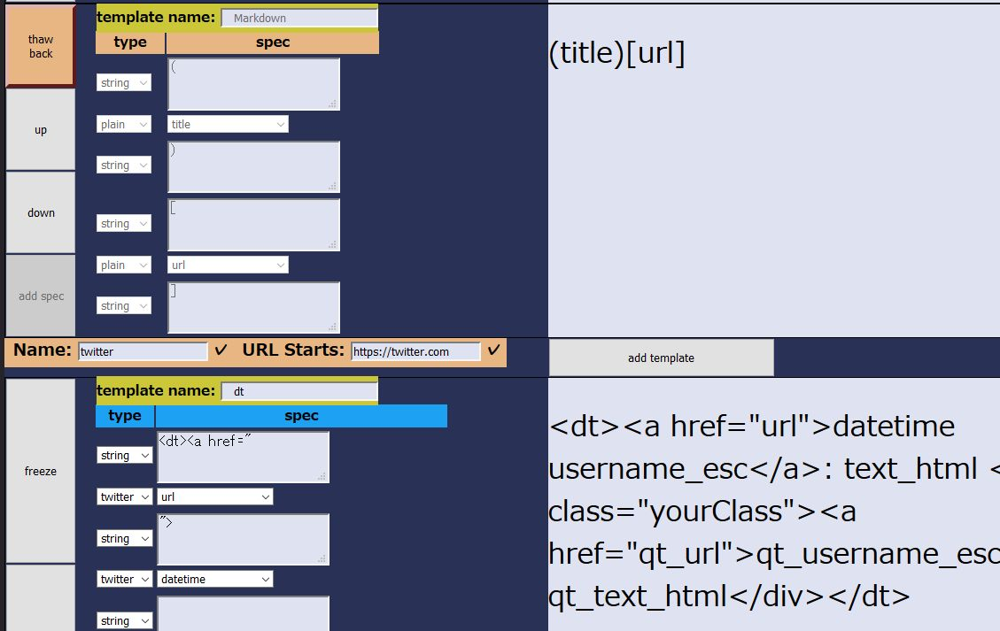
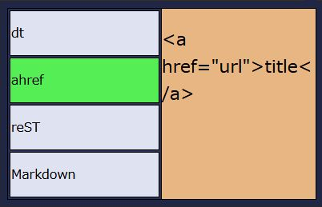

====================
PrsPrsCopy
====================

This add-on is utility for copy url or texts in active web page, specified in templates.
This is now trial development with web-ext, only for the author.

**UPDATE** : Currently published to AMO.
`PrsPrsCopy <https://addons.mozilla.org/ja/firefox/addon/prsprscopy/>`__

What it does
====================

Copy Utility only for text. 
When no range selected on page, Alt-c copy with template composedof url, title, or so. 
Also, we can copy from Toolbar icon. We can edit templates in options page.

For each 'Alt-c' key, copy text to clipboard. Text is constructed with one of the templates for URL-matched website.
And after Alt-c key, choice of template is shift to next. Next Alt-c means 'copying with other template and shift'.
Toolbar icon tell 'copy is fired' and 'next index of template'.
Also, clicking toolbar icon shows the list of template, and clicking template-name button go 'start copying'.

  

Settings. There are site, and each site may have some templates.
Alt-c key starts 'copy' and shift to next template for the site.
  

Tool has site-specialized spec. Currenly only for twitter.com.
username, datetime, and we can copy from 1-level nested QuotedTweet.
  

From toolbar icon, templates for the site are shown.
And we can do copy by simply clicking button.

Known Issue
====================

Fail to copy when quoted tweet inserted in the middle.
--------------------------------------------------------------------------------

only noticed. I saw it just once.

